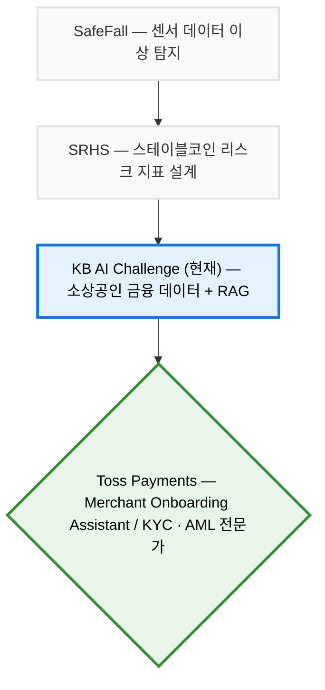

https://app.notion.com/p/39a121c0130680e88b08c5fb1bbc7ce8?source=copy_link
# 2026 KB AI Challenge: 소상공인 금융 지원 AI Agent

> **"비정형 금융 문서를 정확하게 이해하고 필요한 정보를 선제적으로 식별하는 KYC 전문가"**

## 🚀 Career Journey & Vision

저는 리스크를 사후에 분석하는 것이 아니라, 발생 이전 단계에서 위험 신호를 식별하는 **금융 리스크 전문가**를 목표로 합니다. 궁극적으로는 **토스페이먼츠의 Merchant Onboarding Assistant(KYC)** 직무에서 자금세탁방지(AML) 및 고객확인(KYC) 전문가로 성장하고자 합니다.



과거 **이상 탐지 모델(SafeFall)**과 **금융 리스크 지표 설계(SRHS)**를 거쳐, 이번 프로젝트에서는 실제 소상공인의 경영/금융 데이터를 다루고 비정형 문서를 처리하는 경험을 쌓음으로써 토스 KYC 직무에 필요한 실무 역량과 시야를 완성해 나가고 있습니다.

---

## 💡 프로젝트 기획 배경 (Why This Project?)

토스의 KYC 업무는 가맹점이 제출한 사업자등록증, 법인등기부등본, 신분증 등 다양한 증빙자료를 검토하여 고객을 확인하고 잠재적인 리스크를 식별하는 역할을 수행합니다.

이러한 역량을 미리 준비하기 위해 본 KB국민은행 AI Challenge에서는 **'소상공인 금융 지원 AI Agent'**를 주제로 선정했습니다. 토스의 주요 고객이기도 한 소상공인의 **경영 환경, 금융 데이터, 정책자금, 상권 정보, 소비 트렌드**를 직접 분석하면서 가맹점의 비즈니스 특성과 리스크 요인을 데이터 기반으로 이해하고자 했습니다.

---

## 🔍 핵심 기술: 왜 RAG(Retrieval-Augmented Generation)인가?

이 프로젝트에서는 정책자금 안내서, 금융상품 설명서, 상권 분석 자료 등 **대부분 PDF 형태로 제공되는 비정형 문서**를 활용해야 했습니다. 방대한 비정형 문서에서 필요한 정보를 정확하게 발췌하고 검토하는 시스템을 구축하기 위해 RAG 아키텍처를 도입했습니다.

### RAG 프로세스
1. **수집**: 공공기관 및 금융기관의 PDF 문서 수집
2. **전처리**: PDF를 Markdown 형식으로 구조화하여 변환
3. **분할**: 의미를 유지하며 Chunk 단위로 분할
4. **임베딩**: `BAAI/bge-m3` 모델을 활용하여 다국어/의미 기반 벡터 생성
5. **저장**: `ChromaDB` (Vector DB)에 저장
6. **검색 및 생성**: Retriever가 관련 정보를 정확히 검색하고, LLM이 이를 근거로 답변 생성

이를 통해 환각(Hallucination)이 있는 단순한 생성형 AI가 아니라, **실제 금융 문서를 근거로 답변하는 금융 특화 AI Agent**를 구현했습니다.

---

## 🎯 KYC 업무와의 연결성 (What I Learned)

이번 프로젝트를 통해 얻고자 하는 핵심 역량은 단순한 AI 모델 개발 경험이 아닙니다.

- **비정형 문서(PDF) 구조화 파이프라인 구축**
- **필요한 정보의 정확한 검색 및 추출 (RAG 최적화)**
- **다양한 데이터를 결합한 기반의 리스크 분석**
- **금융 문서의 맥락 이해 및 검토 능력**

이러한 경험은 토스 Merchant Onboarding Assistant가 방대한 가맹점 정보 속에서 잠재적 리스크를 선제적으로 식별하고, 고객 확인을 꼼꼼하게 수행하는 업무와 그 본질이 매우 유사합니다. 이 과정을 통해 저는 **비정형 금융 문서를 정확하게 이해하고 위험을 식별하는 역량**을 갖춘 인재로 성장하고 있습니다.

---

## 🛠 기술 스택 (Tech Stack)

### 1. AI & Data Pipeline
- **LLM**: OpenAI GPT-4o
- **Framework**: LangChain
- **Embedding**: BAAI/bge-m3
- **Vector DB**: ChromaDB

### 2. Backend & Frontend
- **Backend**: FastAPI (Python)
- **Frontend**: React 18
- **Data API**: 공공데이터포털 API 연동

---

# 📚 Data Sources

## Policy Documents (PDF)

| Source | Description | Link |
|--------|-------------|------|
| 중소벤처기업부 | 정책자금 융자계획 공고 | https://www.mss.go.kr |
| 소상공인시장진흥공단 | 소상공인 정책자금 안내서 | https://www.semas.or.kr |
| 신용보증기금 | 보증상품 안내 | https://www.kodit.co.kr |
| 기술보증기금 | 기술보증제도 안내 | https://www.kibo.or.kr |
| 중소벤처기업진흥공단 | 정책자금 지원사업 | https://www.kosmes.or.kr |
| KB국민은행 | 기업금융 / 소상공인 금융상품 | https://obank.kbstar.com |
| IBK기업은행 | 기업금융 상품 안내 | https://www.ibk.co.kr |
| 신한은행 | SOHO 금융상품 | https://bank.shinhan.com |

## AML & KYC Documents (PDF)

가맹점 심사 및 고객확인(KYC) 직무와 연관성을 높이기 위해 추가로 활용하는 금융 규제 가이드라인입니다.

| Source | Description |
| ------ | ----------- |
| 금융정보분석원(FIU) | 고객확인제도(KYC) 가이드라인 |
| 금융위원회 | 자금세탁방지(AML) 관련 자료 |
| 금융감독원 | 전자금융업 및 내부통제 가이드 |
| 한국금융연수원 | AML 교육자료 |

---

## Open Data

| Source | Description | Link |
|--------|-------------|------|
| 소상공인시장진흥공단 상권정보(OpenAPI) | 상권분석 데이터 | https://sg.sbiz.or.kr |
| 공공데이터포털 | Open API 및 공공데이터 | https://www.data.go.kr |
| 한국은행 ECOS | 경제통계시스템 | https://ecos.bok.or.kr |
| KOSIS 국가통계포털 | 국가통계 데이터 | https://kosis.kr |

---

## AI / RAG Pipeline

- PDF Documents
- Markdown Conversion
- Chunking
- Embedding (BAAI/bge-m3)
- Vector Database (ChromaDB)
- Retriever
- LLM (Qwen / Llama)

---

## Data Processing Workflow

```text
Official PDF Documents & KYC Guidelines
        │
        ▼
Markdown Conversion
        │
        ▼
Chunking
        │
        ▼
Embedding (BAAI/bge-m3)
        │
        ▼
ChromaDB
        │
        ▼
Retriever
        │
        ▼
LLM
        │
        ▼
Evidence-based Financial Recommendation & Risk Alert
```
